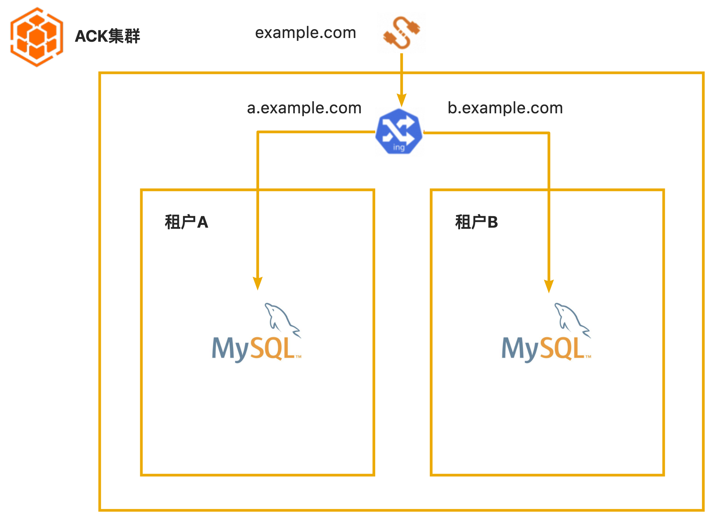
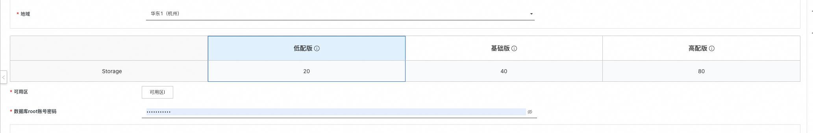
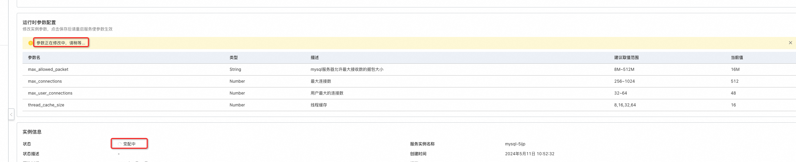
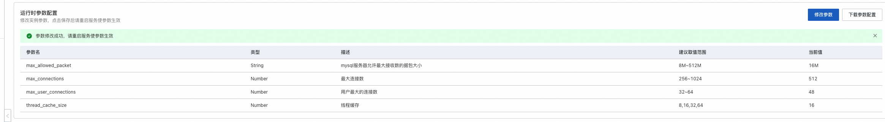

# 服务模板说明文档

## 服务说明

本文介绍容器服务部署mysql实现托管版多租户的流程，本示例对应的Git仓库地址为：[mysql-managed-ack-demo](https://github.com/aliyun-computenest/mysql-managed-ack-demo)。

根据该服务模板构建的服务默认包含三种套餐：

| 套餐名  | 副本数 | 数据卷容量              |  
|--------|-----|------------------|
| 低配版 | 1   | ESSD云盘 20GiB PL0 | 
| 基础版 | 2   | ESSD云盘 40GiB PL0 | 
| 高配版 | 2   | ESSD云盘 80GiB PL0 |

本示例创建过程大约持续1分钟，当服务变成待提交后构建成功。

## 服务使用前提准备
本示例需要提前准备容器集群，集群类型支持ACK、ACS等类型。推荐使用[基础资源配置服务](https://computenest.console.aliyun.com/service/instance/create/cn-hangzhou?type=user&ServiceId=service-9ee2ab978b014397b0cc)，进行基础资源一键配置。

## 服务架构

本部署架构为容器集群多租户部署，架构如下图所示：
1. 使用ingress根据域名路由到各个租户的mysql
2. 每个租户一个k8s namespace，用namespace隔离
3. mysql使用yaml部署

## 服务构建计费说明

测试本服务构建无需任何费用，创建服务实例涉及的费用参考下文"服务实例计费说明"。

## 服务实例计费说明

测试本服务在计算巢上的费用主要涉及：

- 导入的容器集群的费用
- 在容器集群新建的磁盘、网络等费用

## 服务实例部署流程

### 部署步骤

0. 部署链接
   
1. 单击部署链接，进入服务实例部署界面，根据界面提示，填写参数完成部署
   
2. 参数填写完成后可以看到对应询价明细，确认参数后点击**下一步：确认订单**
3. 确认订单完成后同意服务协议并点击**立即创建**
   进入待部署阶段。
   
4. 在用户侧进入待部署状态后需要服务商同意用户的部署
   
   
5. 等待部署完成后就可以开始使用服务，通过Endpoint即可访问mysql
   
6. 部署成功后，用户侧和服务商都可以在控制台查看监控大盘
   用户侧：
   
7. 用户可根据自己的需求修改mysql的配置参数，进入实例详情，点击修改参数：
   
   修改完成后，点击保存，大致需要耗时1分钟左右
   
   修改完成后如下图所示
   

# 更多功能

## 计量计费

[自定义服务架构图](https://help.aliyun.com/zh/compute-nest/customize-a-service-architecture?spm=a2c4g.11186623.0.0.56e736bfyUdlFm])

[服务文档上线流程](https://help.aliyun.com/zh/compute-nest/use-cases/publish-documents-to-compute-nest?spm=a2c4g.313309.0.i0])

[将服务上架云市场并上到云市场售卖](https://help.aliyun.com/zh/compute-nest/publish-a-service-to-alibaba-cloud-marketplace?spm=a2c4g.11186623.0.i7])

## 服务配置

[创建代运维服务完成实例运维](https://help.aliyun.com/zh/compute-nest/create-a-hosted-operations-and-maintenance-service?spm=a2c4g.11186623.0.i24#task-2167552])

[创建包含变配功能的服务](https://help.aliyun.com/zh/compute-nest/use-cases/create-a-service-that-supports-specification-changes-and-change-the-specifications-of-a-service-instance?spm=a2c4g.11186623.0.i3])

[创建包含服务升级功能的服务](https://help.aliyun.com/zh/compute-nest/upgrade-a-service-instance?spm=a2c4g.11186623.0.i17#task-2236803)